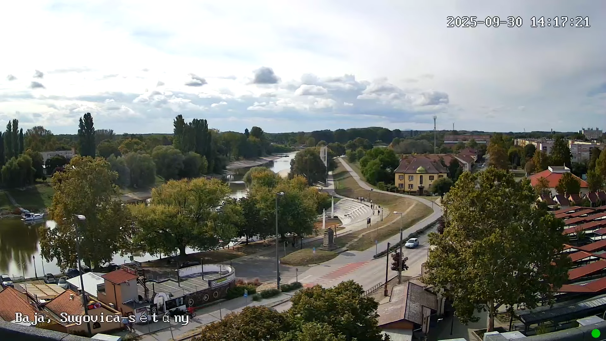
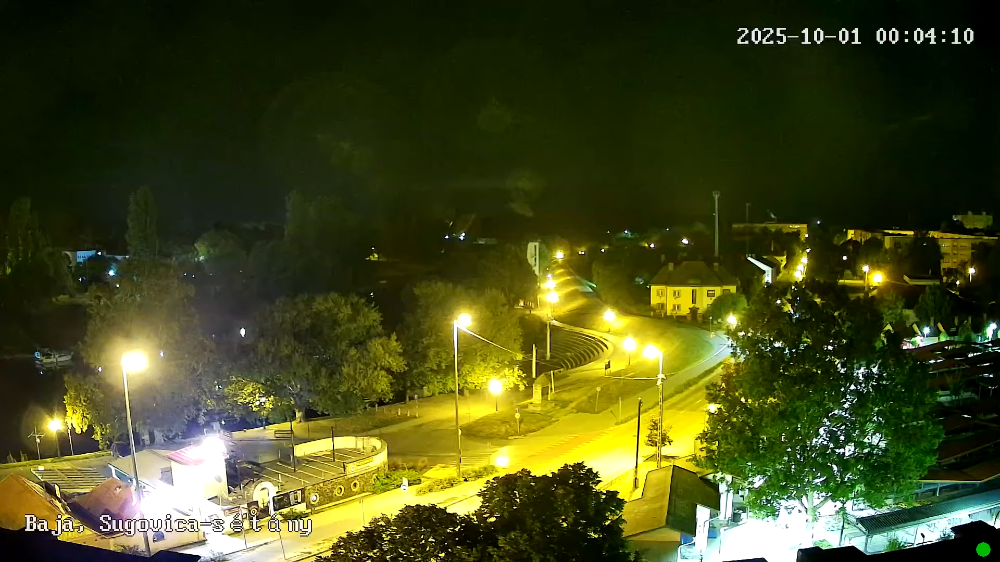
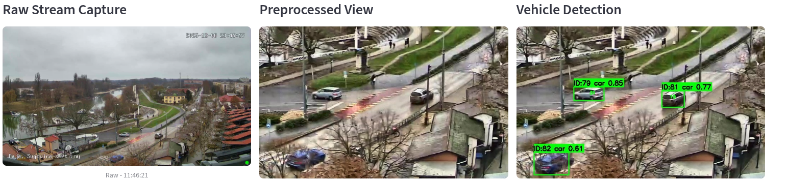
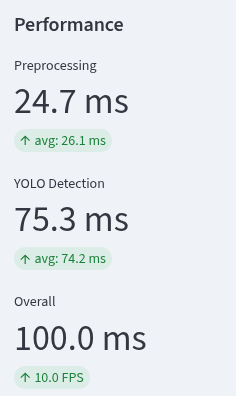
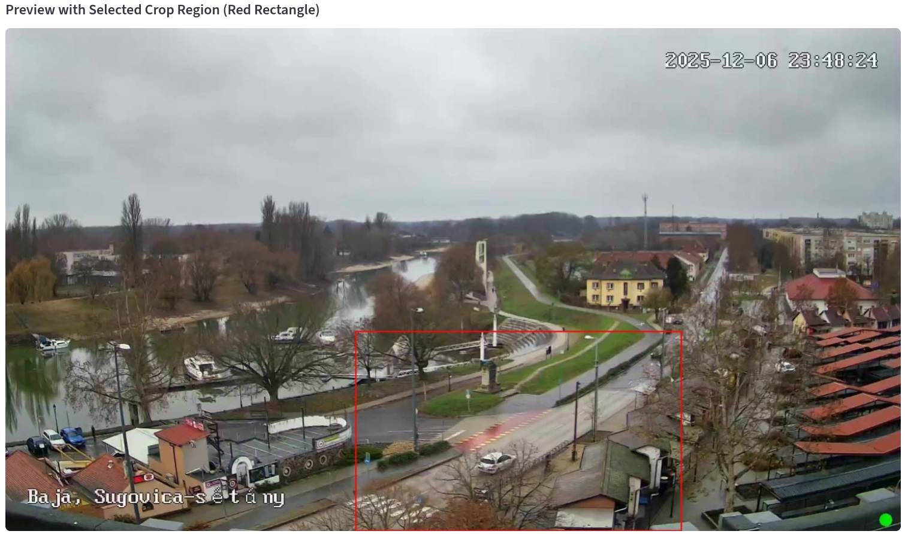
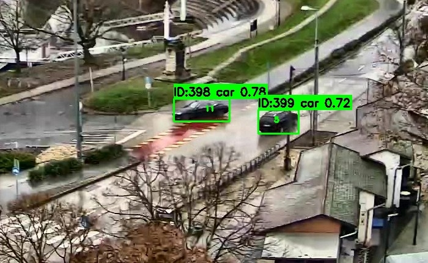

# Flowium - Forgalomfigyelő és Előrejelző Rendszer

## Áttekintés

A Flowium egy valós idejű forgalomfigyelő és előrejelző rendszer, amely élő videófolyamból detektál járműveket és gépi tanulással előrejelzi a forgalmi mintákat. A projekt Docker konténerekre épülő mikroszolgáltatás architektúrát használ.

### Főbb jellemzők

- Valós idejű járműdetektálás YOLOv8 modellel
- Adaptív képfeldolgozás különböző fényviszonyok mellett
- Online gépi tanulás forgalom előrejelzéshez
- Időjárási adatok integrálása
- Interaktív webes dashboard
- Docker alapú, könnyen skálázható architektúra

## Technológiai Stack

| Kategória | Technológia | Felhasználás |
|-----------|-------------|--------------|
| Programozási nyelv | Python | Fejlesztési környezet |
| Videó stream | yt-dlp | YouTube stream letöltése |
| Videó feldolgozás | FFmpeg | Videó feldolgozása |
| Gépi látás | OpenCV | Videó és kép feldolgozása |
| Objektum detektálás | YOLOv8 | Járműdetektálás és követés |
| Adatbázis | SQLite | Adattárolás |
| Online tanulás | River | Valós idejű modell létrehozása |
| Adatmanipuláció | Pandas, NumPy | Adatfeldolgozás |
| API keretrendszer | FastAPI | REST API végpontok |
| Konténerizáció | Docker | Környezetek futtatása |
| Web UI | Streamlit | Interaktív dashboard |

## Rendszerarchitektúra

```
┌─────────────────┐     ┌──────────────────┐     ┌─────────────────┐
│  Stream Capture │────>│  Preprocessing   │────>│ YOLO Detector   │
│   (yt-dlp)      │     │  (OpenCV)        │     │  (YOLOv8)       │
└─────────────────┘     └──────────────────┘     └────────┬────────┘
                                                            │
                        ┌───────────────────────────────────┘
                        ▼
┌─────────────────┐     ┌──────────────────┐     ┌─────────────────┐
│  Weather API    │────>│  Data Manager    │────>│ Online Learner  │
│ (OpenWeatherMap)│     │  (SQLite/API)    │     │  (River ML)     │
└─────────────────┘     └────────┬─────────┘     └─────────────────┘
                                 │
                                 ▼
                        ┌──────────────────┐
                        │   Web UI         │
                        │  (Streamlit)     │
                        └──────────────────┘
```

A Flowium hét fő mikroszolgáltatásból áll, amelyek egy közös Docker hálózaton kommunikálnak:

### Szolgáltatások

1. **stream-capture**: YouTube élő videófolyam fogadása
2. **preprocessing**: Képkockák adaptív előfeldolgozása
3. **yolo-detector**: Járműdetektálás és követés
4. **data-manager**: Központi adatbázis kezelés
5. **online-learner**: Online gépi tanulási modell
6. **weather-service**: Időjárási adatok lekérése
7. **web-ui**: Webes felhasználói felület

## Főbb Algoritmusok

### Járműkövető Mechanizmus

A rendszer egy mohó illesztési algoritmust használ, amely az Intersection over Union (IoU) és a centroid távolság alapján párosítja a detektált objektumokat a nyomvonalakkal.

### Adaptív Előfeldolgozás

A rendszer automatikusan felismeri a fényviszonyokat és adaptívan alkalmazza a képjavító technikákat:

- **Éjszakai javítás**: Gamma korrekció + CLAHE magas klipkorláttal
- **Nappali javítás**: Enyhe CLAHE a túlexponálás elkerülésére
- **Opcionális háttérkivonás**: MOG2 algoritmussal

### Online Tanulási Folyamat

A `river` könyvtár alapú folyamatos tanulás:

1. StandardScaler normalizálás
2. Lineáris regresszió online optimalizálással
3. Folyamatos frissítés új adatpontokkal
4. Automatikus modell mentés és betöltés

## Telepítés

### Előfeltételek

- Docker Engine
- Docker Compose

### Telepítési Lépések

1. **Forrásfájlok letöltése**
```bash
git clone <repository-url>
cd flowium
```

2. **Környezeti változók beállítása**
```bash
cp .env.example .env
nano .env
```

3. **Kötelező változók a .env fájlban:**
```bash
YOUTUBE_URL=<youtube-live-stream-url>
LOCATION=Baja,HU
LATITUDE=46.1811
LONGITUDE=18.9500
```

4. **Szolgáltatások építése és indítása**
```bash
docker-compose up -d --build
```

5. **Logok ellenőrzése**
```bash
docker-compose logs -f
```

6. **Web felület elérése**

Nyisd meg a böngészőben: `http://localhost:8501`

## Konfigurációs Paraméterek

### Stream Capture
- `YOUTUBE_URL`: A YouTube élő közvetítés URL-je
- `FPS`: Feldolgozási sebesség (alapértelmezett: 5)

### Preprocessing
- `YOLO_DETECTOR_URL`: YOLO szolgáltatás címe
- Adaptív beállítások runtime módosíthatók az API-n keresztül

### YOLO Detector
- `CONFIDENCE_THRESHOLD`: Detektálás bizalmi küszöbe (alapértelmezett: 0.5)
- `MAX_AGE`: Nyomvonal maximális kora (alapértelmezett: 30)
- `MIN_HITS`: Megerősítéshez szükséges találatok (alapértelmezett: 3)

### Data Manager
- `DATABASE_PATH`: SQLite adatbázis helye (alapértelmezett: /db-data/flowium.db)

### Online Learner
- `DATA_MANAGER_URL`: Data manager szolgáltatás címe
- `MODEL_PATH`: Tanult modell mentési helye

### Weather Service
- `LOCATION`: Helységnév (alapértelmezett: Baja,HU)
- `LATITUDE`, `LONGITUDE`: Koordináták
- `WEATHER_FETCH_INTERVAL`: Lekérdezési intervallum másodpercben (alapértelmezett: 600)

## API Végpontok

### Data Manager

**POST /detections**
```python
{
  "detections": [
    {
      "class_id": 2,
      "class_name": "car",
      "confidence": 0.87,
      "bbox": [100, 200, 300, 400],
      "timestamp": "2025-12-07T10:30:00"
    }
  ]
}
```

**POST /weather**
```python
{
  "temperature": 15.5,
  "humidity": 65.0,
  "weather_condition": "clear",
  "precipitation": 0.0,
  "wind_speed": 3.2
}
```

### Online Learner

**POST /train**
```python
{
  "hour": 14,
  "day_of_week": 2,
  "temperature": 20.0,
  "humidity": 50.0,
  "precipitation": 0.0,
  "vehicle_count": 45
}
```

**POST /predict**
```python
{
  "hour": 16,
  "day_of_week": 2,
  "temperature": 22.0,
  "humidity": 48.0,
  "precipitation": 0.0
}
```

## Teljesítmény Optimalizálás

### YOLO Modell ONNX Konverzió

A projekt tartalmaz egy szkriptet a YOLOv8 modell ONNX formátumra való konvertálásához, amely jelentős teljesítménynövekedést eredményez CPU-alapú rendszereken:

```bash
python services/yolo-detector/export_model.py
```

**Teljesítmény összehasonlítás:**

| Formátum | Fájlméret | Inferencia idő (CPU) |
|----------|-----------|---------------------|
| PyTorch (.pt) | 6.2 MB | ~200 ms |
| ONNX (.onnx) | 12.2 MB | ~80 ms |

## Web Felület Funkciók

### Főoldal
- Élő videófolyam megjelenítés
- Előfeldolgozott és detektált képkockák
- Valós idejű feldolgozási sebesség

### Analytics Tab
- Forgalmi trendek vizualizációja
- Legutóbbi 10 detekció táblázatos megjelenítése
- Időjárási adatok korrelációja
- Órás aggregált statisztikák

### Predictions Tab
- Modell teljesítmény mutatók (MAE, tanított minták száma)
- 24 órás előrejelzés interaktív diagramon
- Tanítási történet vizualizációja
- Hiba eloszlás hisztogram

### Settings Tab
- Előfeldolgozási paraméterek futásidejű módosítása
- Crop, adaptive enhancement, denoising beállítások
- Háttérkivonás ki/bekapcsolása

## Mintaképek














## Továbbfejlesztési Lehetőségek

- GPU támogatás CUDA-val (jelenleg csak CPU alapú feldolgozás)
- Több kamera párhuzamos feldolgozása
- Bővített járműtípus detektálás
- Real-time értesítések dugó esetén
- REST API bővítése további végpontokkal

## Licensz

Ez a projekt MIT licensz alatt áll - további részletekért lásd a **LICENSE** fájlt.

## Credits

A főbb felhasznált könyvtárak:
* **Python** - Programozási nyelv
* **Docker** - Konténerizációs platform
* **YOLOv8** (Ultralytics) - Objektum detektálási modell
* **OpenCV** - Számítógépes látás könyvtár
* **FastAPI** - Modern, gyors web framework API-khoz
* **Streamlit** - Web UI framework adatvizualizációhoz
* **River** - Online gépi tanulási könyvtár
* **FFmpeg** - Videó feldolgozási eszköz
* **yt-dlp** - Videó letöltő eszköz
* **SQLite** - Beágyazott adatbázis
* **Pandas & NumPy** - Adatmanipulációs könyvtárak
* **Matplotlib & Seaborn** - Vizualizációs könyvtárak
* **Pydantic** - Adatvalidáció
* **Open-Meteo API** - Időjárási adatok forrása

## Köszönetnyilvánítás

Köszönet a YouTube élő közvetítést biztosító csatornának, valamint az összes nyílt forráskódú projekt készítőinek, akik lehetővé tették ezt a projektet.
